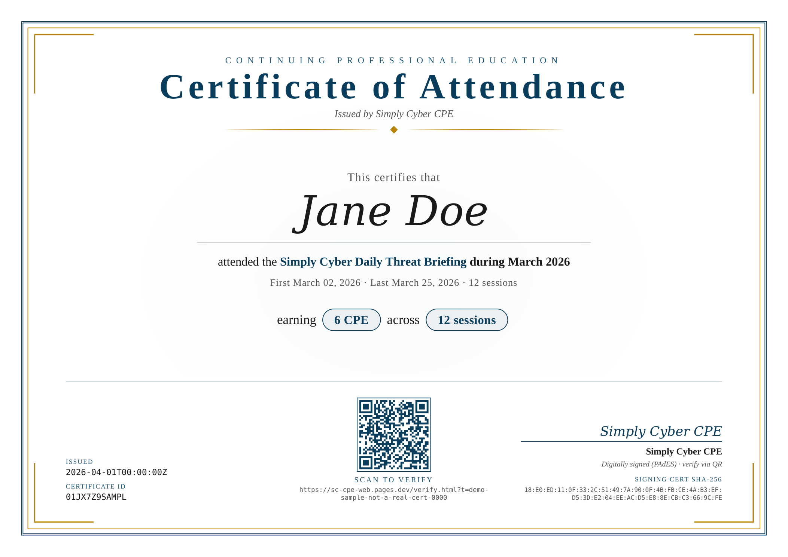

<p align="center">
  
  <br/>
  <strong>SC-CPE</strong> — Simply Cyber CPE Certificates
  <br/>
  <em>Automatic, cryptographically verifiable continuing-education certificates<br/>for everyone who shows up to the Daily Threat Briefing.</em>
</p>

<p align="center">
  <a href="https://github.com/ericrihm/sc-cpe/actions/workflows/deploy-prod.yml"></a>
  <a href="https://github.com/ericrihm/sc-cpe/actions/workflows/smoke.yml"></a>
  <a href="https://github.com/ericrihm/sc-cpe/actions/workflows/ci.yml"></a>
  <a href="https://sc-cpe-web.pages.dev/status.html"></a>
  <a href="https://sc-cpe-web.pages.dev/verify.html"></a>
  <a href="LICENSE"></a>
</p>

**[Verify a certificate](https://sc-cpe-web.pages.dev/verify.html)** · **[Leaderboard](https://sc-cpe-web.pages.dev/leaderboard.html)** · **[Show links](https://sc-cpe-web.pages.dev/links.html)** · **[Public profiles](https://sc-cpe-web.pages.dev/profile.html)** · **[Contribute](CONTRIBUTING.md)**

# SC-CPE

Automated CPE/CEU certificate issuance for security professionals who attend the Simply Cyber Daily Threat Briefing livestream, with cryptographic proof of attendance and offline-verifiable signed credentials.

---

## What & Why

SC-CPE watches the [Simply Cyber Daily Threat Briefing](https://www.youtube.com/@simplycyber) YouTube live chat, matches per-user verification codes, and issues **signed PDF certificates** worth **0.5 CPE / CEU per session**. Every certificate is PAdES-T signed with an RFC-3161 timestamp and anchored to an append-only, hash-chained audit log — verifiable offline, years later, without contacting the issuer.

CPE tracking is a pain point for security professionals — manual logs, inconsistent records, and no way to independently verify attendance. Unlike traditional self-reported CPE systems, SC-CPE solves this by automating the entire pipeline from livestream attendance through signed certificate delivery, giving holders a credential that any auditor can check without trusting the issuer.

> [!TIP]
> 20 weekday briefings/month = **10 CPE**. Enough to cover a significant chunk of most annual renewal requirements.

---

## Supported Programs

| Program | Credit | Per Session | Submission Format |
|:--------|:-------|:------------|:------------------|
| **CompTIA** (Security+, CySA+, CASP+, PenTest+, Network+ ...) | CEU | 0.5 CEU | Proof-of-attendance: name, date(s), hours, provider, signature |
| **ISC2** (CISSP, SSCP, CCSP ...) | CPE | 0.5 CPE (Group B) | Same fields — upload under "Education" |
| **ISACA** (CISM, CISA, CRISC, CGEIT, CDPSE ...) | CPE | 0.5 CPE | All 7 ISACA audit-evidence fields present |

Acceptance is ultimately the certification body's decision — see [Terms §5](https://sc-cpe-web.pages.dev/terms.html#5).

> [!IMPORTANT]
> **ISACA 2027 update:** Starting January 2027, ISACA splits CPE into *certification-aligned* (90 CPE min) and *professional-aligned* (30 CPE max). The Daily Threat Briefing covers threats, risk management, security operations, and governance — all certification-aligned domains. SC-CPE certificates already include the activity description field needed for domain-relevance verification.

---

## Quickstart

```
1. Register    →  sc-cpe-web.pages.dev  (email + legal name + Turnstile)
2. Get code    →  check your email for SC-CPE{XXXX-XXXX}
3. Post code   →  paste it in YouTube live chat during the briefing
4. Get credit  →  shows on your dashboard within ~60 seconds
5. Get cert    →  per-session (~2h) or monthly bundle — your pick
```

Your dashboard link arrives by email from `certs@signalplane.co`. Lost it? Just visit [`/dashboard`](https://sc-cpe-web.pages.dev/dashboard.html) — an inline login form emails you a fresh link. You can also opt-in to "remember this device" so your dashboard loads without the URL token.

---

## How It Works

<picture>
  <source media="(prefers-color-scheme: dark)" srcset="docs/assets/diagram-how-it-works-dark.svg">
  <source media="(prefers-color-scheme: light)" srcset="docs/assets/diagram-how-it-works-light.svg">
  
</picture>

<details>
<summary><strong>Detailed data flow</strong></summary>

```
 1.  Register at sc-cpe-web.pages.dev
     → email + Turnstile. Dashboard link + SC-CPE{XXXX-XXXX} code arrive
       by email. The HTTP response never contains them — email possession
       is the activation gate.

 2.  Post your code in YouTube live chat during the stream.
     → The poller (every minute, 08:00-11:00 ET Mon-Fri) ingests chat,
       matches your code, and credits 0.5 CPE. Pre-stream chat and
       replays don't count. Dashboard tells you if you posted too early.

 3.  Pick cert style in the dashboard: per-session, bundled, or both.
     → Per-session certs arrive within ~2h. Bundled certs ship monthly.
       Both are PAdES-T signed.

 4.  Submit to your CE portal.
     → Upload the PDF under "webinars/seminars/training." The cert is
       the proof document.

 5.  Verify any cert at /verify.html
     → Drop the PDF on the page. SHA-256 is recomputed client-side and
       compared to the registered hash. Anyone — including auditors —
       can check without contacting us.
```

</details>

---

## Architecture

<picture>
  <source media="(prefers-color-scheme: dark)" srcset="docs/assets/diagram-architecture-dark.svg">
  <source media="(prefers-color-scheme: light)" srcset="docs/assets/diagram-architecture-light.svg">
  
</picture>

| Component | Tech | What it does |
|:----------|:-----|:-------------|
| **Pages Functions** | Cloudflare Pages | Registration, dashboard, verify, profiles, admin API, analytics, CSV export, links archive |
| **Poller** | CF Worker · `* * * * *` | Polls YouTube live chat (OAuth + API-key fallback), matches codes, credits attendance, updates streaks, extracts show links |
| **Email Sender** | CF Worker · `*/2 * * * *` | Drains `email_outbox` via Resend |
| **Purge** | CF Worker · `0 9 * * *` | Daily R2 chat GC, security digest, weekly digest, cert nudge, renewal nudges, link enrichment, monthly digest, Discord webhooks |
| **Cert Signer** | Python 3.11 (GH Actions) | WeasyPrint render + `endesive` PAdES-T with RFC-3161 |
| **Chat Rescan** | Python (GH Actions) · daily 16:00 UTC | Recovers missed attendance from chat replays |
| **D1** | Cloudflare SQLite | Single source of truth — schema in `db/schema.sql` |
| **R2** | Cloudflare Object Storage | Raw chat JSONL (purges daily) + signed PDF certs + weekly backups |
| **KV** | Cloudflare KV | Rate-limit counters + circuit breaker state |

---

## Tech Stack

| Layer | Tech |
|:------|:-----|
| Frontend | Cloudflare Pages (static HTML + JS, CSP `script-src 'self'`) |
| API | Cloudflare Pages Functions (V8 isolates) |
| Workers | Cloudflare Workers (poller, purge, email-sender) |
| Database | Cloudflare D1 (SQLite) |
| Storage | Cloudflare R2 (certs, chat, backups) |
| Caching | Cloudflare KV (rate limits, circuit breakers) |
| Email | Resend (DKIM + SPF + DMARC) |
| Certs | Python + WeasyPrint + endesive (PAdES-T) |
| CI/CD | GitHub Actions (13 workflows) |

---

## Certificate Integrity

<picture>
  <source media="(prefers-color-scheme: dark)" srcset="docs/assets/diagram-cert-integrity-dark.svg">
  <source media="(prefers-color-scheme: light)" srcset="docs/assets/diagram-cert-integrity-light.svg">
  
</picture>

> [!NOTE]
> Anyone can generate a PDF that says "attended." SC-CPE certificates are different because each one is anchored to four independent, durable pieces of evidence.

<table>
<tr>
<td width="50%">

**1. Time-gated attendance** — The poller only credits messages whose YouTube `publishedAt` falls inside the live window. Pre-stream chat and replays don't count. Rejected attempts are logged and surfaced on your dashboard.

**2. Hash-chained audit log** — Every state transition is recorded in an append-only, SHA-256 chained table with a `UNIQUE INDEX` on `prev_hash`. Chain forks fail at insert time. `verify_audit_chain.py` replays the full chain.

</td>
<td width="50%">

**3. PAdES-T + RFC-3161** — Certs are signed with a dedicated CA-rooted key and bound to a trusted timestamp authority. The signature outlives the key's validity period. The signing cert fingerprint is on the face of every PDF.

**4. Public verify URL** — Each cert carries a `/verify.html?t=...` link anyone can open — no login required. Drop the PDF on the page and the browser recomputes its SHA-256 client-side against the registered hash.

</td>
</tr>
</table>

```
user_registered → code_matched → attendance_credited → cert_issued → email_sent
       ▲                                                      ▲
       └──────── prev_hash = sha256(canonicalAuditRow(tip)) ──┘
```

---

## Features

### Cert Delivery Options

| Option | Best for | Delivery |
|:-------|:---------|:---------|
| **Per-session** | CompTIA (1 activity per submission) | On demand, ~2h after request |
| **Monthly bundle** | ISC2 / ISACA (annual rollup) | Auto-generated end of month |
| **Both** | Multiple certifications | Per-session + monthly |

Change your preference anytime from the dashboard.

### Community & Engagement

<picture>
  <source media="(prefers-color-scheme: dark)" srcset="docs/assets/diagram-features-dark.svg">
  <source media="(prefers-color-scheme: light)" srcset="docs/assets/diagram-features-light.svg">
  
</picture>

**User dashboard** — Attendance calendar, streak tracking (current + longest, weekday-aware), renewal countdown, annual summary, bulk cert download, appeal flow, inline sign-in, and device-memory opt-in.

**Community** — Opt-in leaderboard with streak column, public profiles (privacy-safe: first name + last initial), shareable SVG badges, show links archive with RSS feed.

**Admin & ops** — Analytics dashboard (growth, engagement, certs, system charts), CSV export (users / attendance / certs), appeal resolution queue, feature toggles, cert reissue/revoke/resend, manual attendance grants.

**Communications** — Monthly digest, weekly digest, cert nudges, renewal milestone emails (50% / 75% / 90% + 30-day warning), Discord webhooks (cert announcements + weekly leaderboard top-5).

---

## Observability

| Signal | Source | Cadence |
|:-------|:-------|:--------|
| Poller heartbeat | D1 `heartbeats` | Every minute (during stream window) |
| Purge / security / digest / cert nudge / renewal nudge | D1 `heartbeats` | Daily / weekly / monthly |
| Email sender | D1 `heartbeats` | Every 2 minutes |
| Synthetic canary | GH Actions `smoke.yml` | Hourly — pings prod, writes canary heartbeat |
| Watchdog | GH Actions `watchdog.yml` | Every 15 min — `/api/health` poll, Discord alerts |
| Audit chain | GH Actions `audit-chain-weekly.yml` | Weekly full chain walk |
| Schema drift | GH Actions `schema-drift.yml` | Weekly D1-vs-`schema.sql` diff |
| Chat rescan | GH Actions `rescan-chat.yml` | Daily 16:00 UTC — recovers missed attendance |
| D1 backup | GH Actions `backup.yml` | Weekly Sun 06:00 UTC → R2 + GitHub Artifact |
| CodeQL | GH Actions `codeql.yml` | Weekly + on push |

Live status: [`/status.html`](https://sc-cpe-web.pages.dev/status.html) (auto-refreshes every 30s)

---

## CI/CD Pipeline

<picture>
  <source media="(prefers-color-scheme: dark)" srcset="docs/assets/diagram-cicd-dark.svg">
  <source media="(prefers-color-scheme: light)" srcset="docs/assets/diagram-cicd-light.svg">
  
</picture>

Branch protection on `main`: PRs required, `Node test suite` + `Secret scan (gitleaks)` must pass, no force-push. Auto-merge enabled — `gh pr merge --auto --squash` lands the PR the moment checks go green.

D1 migrations in `db/migrations/` are applied automatically during deploy — the pipeline tracks applied files in `_applied_migrations` and only runs new ones.

**PR previews** — Every pull request gets an isolated preview deployment with its own D1, KV, and R2 bindings. The [`deploy-preview.yml`](.github/workflows/deploy-preview.yml) workflow applies migrations, seeds test data, deploys, and comments the preview URL on the PR.

---

<details>
<summary><strong>API Surface (46 endpoints)</strong></summary>

### Public

| Path | Auth | Purpose |
|:-----|:-----|:--------|
| `POST /api/register` | Turnstile | Sign up |
| `POST /api/recover` | Turnstile | Recover dashboard link via email |
| `GET /api/health` | public | External watchdog poll |
| `GET /api/verify/{token}` | public | Cert verification data |
| `GET /api/crl.json` | public | Certificate revocation list |
| `GET /api/leaderboard` | public | Community leaderboard (top 20) |
| `GET /api/links` | public | Show links archive |
| `GET /api/links/rss` | public | Show links RSS feed |
| `GET /api/profile/{token}` | public | Public profile (privacy-safe stats) |
| `GET /api/badge/{token}` | public | SVG achievement badge |
| `GET /api/download/{token}` | public | Cert PDF download |
| `GET /api/preflight/channel` | public | YouTube channel pre-check |
| `POST /api/csp-report` | public | CSP violation reports |

### User (dashboard-token + CSRF)

| Path | Auth | Purpose |
|:-----|:-----|:--------|
| `GET /api/me/{token}` | dashboard-token | User dashboard data |
| `POST /api/me/{token}/prefs` | + CSRF | Set cert style, nudge opt-out, leaderboard opt-in |
| `POST /api/me/{token}/cert-per-session/{stream_id}` | + CSRF | Request single-session cert |
| `POST /api/me/{token}/cert-feedback` | + CSRF | Report cert typo/error |
| `POST /api/me/{token}/resend-code` | + CSRF | Get a fresh verification code |
| `POST /api/me/{token}/appeal` | + CSRF | Appeal missed attendance credit |
| `POST /api/me/{token}/delete` | + CSRF | Account deletion (GDPR) |
| `POST /api/me/{token}/rotate` | + CSRF | Rotate dashboard token |
| `GET /api/me/{token}/annual-summary` | dashboard-token | Year-at-a-glance stats |

### Admin (bearer token)

| Path | Auth | Purpose |
|:-----|:-----|:--------|
| `GET /api/admin/heartbeat-status` | bearer | Per-source staleness |
| `GET /api/admin/audit-chain-verify` | bearer | Full chain walk |
| `GET /api/admin/ops-stats` | bearer | Dashboard counts + warnings |
| `GET /api/admin/cert-feedback` | bearer | Non-ok feedback inbox |
| `GET /api/admin/users` | bearer | User search |
| `GET /api/admin/user/{id}/certs` | bearer | Certs for a specific user |
| `GET /api/admin/attendance` | bearer | Attendance records |
| `GET /api/admin/appeals` | bearer | Pending appeals |
| `POST /api/admin/appeals/{id}/resolve` | bearer | Resolve appeal |
| `POST /api/admin/cert/{id}/reissue` | bearer | Queue cert regeneration |
| `POST /api/admin/cert/{token}/resend` | bearer | Resend cert email |
| `POST /api/admin/revoke` | bearer | Revoke a certificate |
| `GET /api/admin/export` | bearer | CSV export (users, attendance, certs) |
| `GET /api/admin/security-events` | bearer | Security event log |
| `GET /api/admin/analytics/growth` | bearer | User growth time series |
| `GET /api/admin/analytics/engagement` | bearer | Attendance engagement metrics |
| `GET /api/admin/analytics/certs` | bearer | Certificate issuance stats |
| `GET /api/admin/analytics/system` | bearer | System health metrics |
| `POST /api/admin/canary-beat` | bearer | Hourly smoke heartbeat |
| `GET/POST /api/admin/toggles` | bearer | Feature toggles |
| `GET /api/admin/auth/login` | bearer | Admin OAuth login |
| `GET /api/admin/auth/callback` | bearer | Admin OAuth callback |
| `GET /api/admin/auth/logout` | bearer | Admin logout |
| `GET /api/watchdog-state` | bearer | Watchdog health state |

</details>

---

## Design Decisions

- **Hash-chained audit log over simple event table** — append-only with SHA-256 `prev_hash` ensures tampering is detectable years later without a trusted third party. A `UNIQUE INDEX` on `prev_hash` serialises concurrent writers at the database level.

- **Dashboard token over password auth** — a single bearer URL means no password resets, no session management, no cookie consent banners. Trade-off: URL sharing leaks access, mitigated by a separate `badge_token` for public-facing URLs.

- **PAdES-T over simple PDF signing** — RFC-3161 timestamps make certificates verifiable even after the signing key expires. More complexity, but the cert is the product — it must stand on its own.

- **Email-queue pattern over direct send** — decouples email delivery from the request path, enabling retry with idempotency, backpressure visibility via the outbox table, and a clean cursor-advance-on-success contract.

---

## Who Runs This

**Simply Cyber LLC** (United States). Fully open-source at [`github.com/ericrihm/sc-cpe`](https://github.com/ericrihm/sc-cpe) — every line that decides who gets credit, every policy doc, every deploy workflow. Branch protection + required CI + auto-deploy means the deployed code is the exact SHA on `main`.

| Domain | Purpose |
|:-------|:--------|
| `sc-cpe-web.pages.dev` | Web + API (canonical origin) |
| `cpe.simplycyber.io` | Reserved — future DNS wiring |
| `signalplane.co` | Email domain (DKIM + SPF + DMARC) |

Security disclosure: [`security.txt`](https://sc-cpe-web.pages.dev/.well-known/security.txt) or email `certs@signalplane.co` with `[SECURITY]` in the subject.

---

## Testing & Development

```bash
scripts/install_hooks.sh                 # pre-push hook → runs test suite
bash scripts/test.sh                     # pure-logic tests (251 tests)
scripts/check_schema.sh                  # diff live D1 schema vs repo
ADMIN_TOKEN=... ORIGIN=https://sc-cpe-web.pages.dev \
  scripts/smoke_hardening.sh             # read-only probe of deployed origin
```

## Deploying

Auto-deploy on every merge to `main` via [`deploy-prod.yml`](.github/workflows/deploy-prod.yml):
tests → D1 migrations → Pages → Workers (parallel) → post-deploy smoke. ~2 min on a warm runner.

```bash
git checkout -b fix/whatever
git commit -m "fix(scope): description"
git push -u origin fix/whatever
gh pr create --fill && gh pr merge --auto --squash
```

> [!CAUTION]
> **Break-glass only:** `enforce_admins: false` allows admin direct-push to `main`. The push trigger still fires `deploy-prod` with full test suite. Re-engage protection immediately after.

---

## Repo Map

```
pages/                 Cloudflare Pages Functions — public web surface
  functions/api/       JSON API (register, dashboard, admin, analytics, verify, links, profiles)
  _lib.js              Shared helpers (audit, rate-limit, email, crypto)
  _heartbeat.js        Staleness predicates for heartbeat monitoring
  _middleware.js        Security headers (CSP, HSTS, COOP, CORP)
  *.html / *.js / *.css  15 pages, extracted JS/CSS (CSP-safe, no inline scripts)
workers/
  poller/              Per-minute livestream chat poller (OAuth + API-key fallback)
  purge/               Daily R2 GC + digests + nudges + link enrichment + Discord webhooks
  email-sender/        Drains email_outbox via Resend
services/certs/        Python PDF issuer (PAdES-T + RFC-3161)
db/
  schema.sql           Authoritative schema
  migrations/          Append-only numbered migrations (auto-applied on deploy)
  seed-preview.sql     Test data for PR preview environments
scripts/               Smoke, schema check, audit verifier, tests, backups, chat rescan
.github/workflows/     13 workflows: CI, deploy (prod + preview), smoke, watchdog,
                       cert crons, schema drift, backups, chat rescan, CodeQL
docs/
  DESIGN.md            Architecture decisions
  RUNBOOK.md           Operator procedures
  LTV.md               Legal/compliance reasoning (GDPR Art. 17(3)(e))
  VERIFIER_GUIDE.md    Third-party cert verification guide
  PITCH.md             Simply Cyber team pitch
```

## Contributing

Built for the [Simply Cyber](https://www.youtube.com/@SimplyCyber) community. Contributions welcome — see [CONTRIBUTING.md](CONTRIBUTING.md).

Found a bug or have feedback? [Open an issue](https://github.com/ericrihm/sc-cpe/issues) or email certs@signalplane.co.

## License

MIT — see [LICENSE](LICENSE) for details. Cert artefacts are retained under GDPR Art. 17(3)(e) as evidentiary records.
