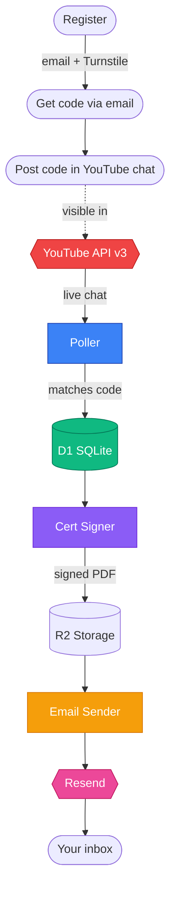
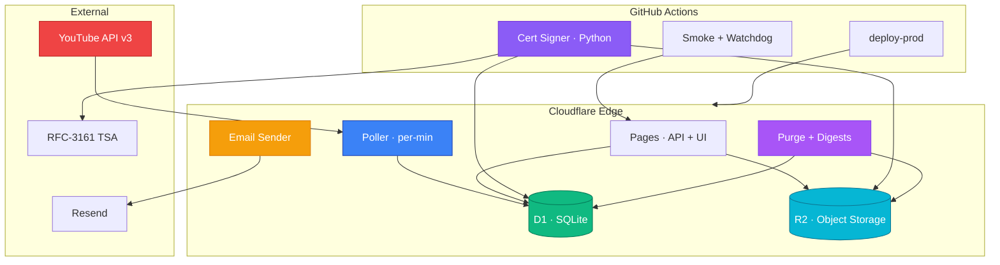
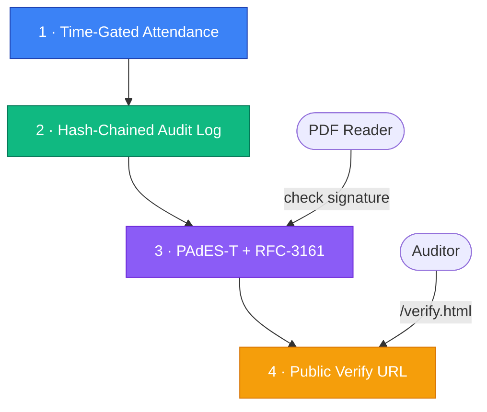
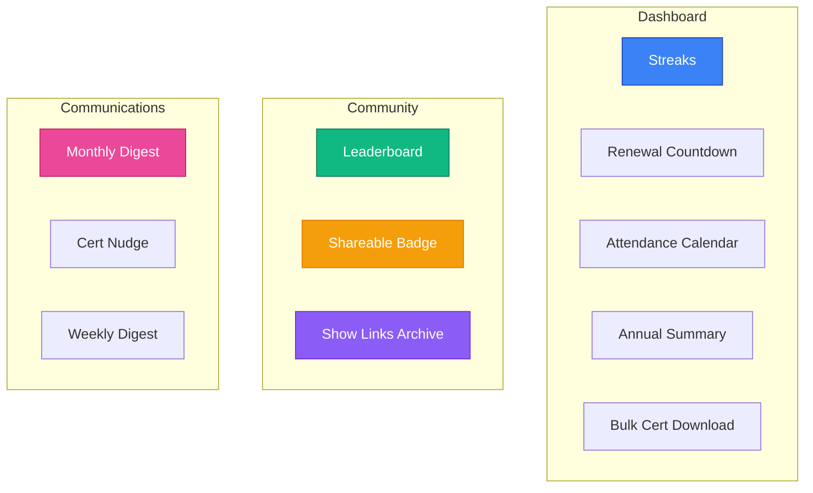
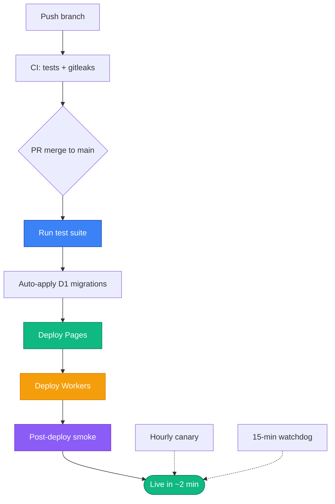

<p align="center">
  
  <br/>
  <strong>SC-CPE</strong> — Simply Cyber CPE Certificates
  <br/>
  <em>Automatic, cryptographically verifiable continuing-education certificates<br/>for everyone who shows up to the Daily Threat Briefing.</em>
</p>

<p align="center">
  <a href="https://github.com/ericrihm/sc-cpe/actions/workflows/deploy-prod.yml"></a>
  <a href="https://github.com/ericrihm/sc-cpe/actions/workflows/smoke.yml"></a>
  <a href="https://github.com/ericrihm/sc-cpe/actions/workflows/ci.yml"></a>
  <a href="https://sc-cpe-web.pages.dev/status.html"></a>
  <a href="https://sc-cpe-web.pages.dev/verify.html"></a>
  <a href="LICENSE"></a>
</p>

**[Verify a certificate](https://sc-cpe-web.pages.dev/verify.html)** · **[View the leaderboard](https://sc-cpe-web.pages.dev/leaderboard.html)** · **[Browse show links](https://sc-cpe-web.pages.dev/links.html)** · **[Contribute](CONTRIBUTING.md)**

---

## What is this?

SC-CPE watches the [Simply Cyber Daily Threat Briefing](https://www.youtube.com/@simplycyber) YouTube live chat, matches per-user verification codes, and issues **signed PDF certificates** worth **0.5 CPE / CEU per session**. Every certificate is PAdES-T signed with an RFC-3161 timestamp and anchored to an append-only, hash-chained audit log — verifiable offline, years later, without contacting the issuer.

> [!TIP]
> 20 weekday briefings/month = **10 CPE**. Enough to cover a significant chunk of most annual renewal requirements.

---

## Supported Programs

| Program | Credit | Per Session | Submission Format |
|:--------|:-------|:------------|:------------------|
| **CompTIA** (Security+, CySA+, CASP+, PenTest+, Network+ ...) | CEU | 0.5 CEU | Proof-of-attendance: name, date(s), hours, provider, signature |
| **ISC2** (CISSP, SSCP, CCSP ...) | CPE | 0.5 CPE (Group B) | Same fields — upload under "Education" |
| **ISACA** (CISM, CISA, CRISC, CGEIT, CDPSE ...) | CPE | 0.5 CPE | All 7 ISACA audit-evidence fields present |

Acceptance is ultimately the certification body's decision — see [Terms §5](https://sc-cpe-web.pages.dev/terms.html#5).

> [!IMPORTANT]
> **ISACA 2027 update:** Starting January 2027, ISACA splits CPE into *certification-aligned* (90 CPE min) and *professional-aligned* (30 CPE max). The Daily Threat Briefing covers threats, risk management, security operations, and governance — all certification-aligned domains. SC-CPE certificates already include the activity description field needed for domain-relevance verification.

---

## Quickstart

```
1. Register    →  sc-cpe-web.pages.dev  (email + legal name + Turnstile)
2. Get code    →  check your email for SC-CPE{XXXX-XXXX}
3. Post code   →  paste it in YouTube live chat during the briefing
4. Get credit  →  shows on your dashboard within ~60 seconds
5. Get cert    →  per-session (~2h) or monthly bundle — your pick
```

Your dashboard link arrives by email from `certs@signalplane.co`. Lost it? Just visit `/dashboard` — an inline login form emails you a fresh link. You can also opt-in to "remember this device" so your dashboard loads without the URL token.

---

## How It Works



<details>
<summary><strong>Detailed data flow</strong></summary>

```
 1.  Register at /register.html
     → email + Turnstile. Dashboard link + SC-CPE{XXXX-XXXX} code arrive
       by email. The HTTP response never contains them — email possession
       is the activation gate.

 2.  Post your code in YouTube live chat during the stream.
     → The poller (every minute, 08:00-11:00 ET Mon-Fri) ingests chat,
       matches your code, and credits 0.5 CPE. Pre-stream chat and
       replays don't count. Dashboard tells you if you posted too early.

 3.  Pick cert style in the dashboard: per-session, bundled, or both.
     → Per-session certs arrive within ~2h. Bundled certs ship monthly.
       Both are PAdES-T signed.

 4.  Submit to your CE portal.
     → Upload the PDF under "webinars/seminars/training." The cert is
       the proof document.

 5.  Verify any cert at /verify.html
     → Drop the PDF on the page. SHA-256 is recomputed client-side and
       compared to the registered hash. Anyone — including auditors —
       can check without contacting us.
```

</details>

---

## Architecture



---

## Certificate Integrity



> [!NOTE]
> Anyone can generate a PDF that says "attended." SC-CPE certificates are different because each one is anchored to four independent, durable pieces of evidence.

<table>
<tr>
<td width="50%">

**1. Time-gated attendance** — The poller only credits messages whose YouTube `publishedAt` falls inside the live window. Pre-stream chat and replays don't count. Rejected attempts are logged and surfaced on your dashboard.

**2. Hash-chained audit log** — Every state transition is recorded in an append-only, SHA-256 chained table with a `UNIQUE INDEX` on `prev_hash`. Chain forks fail at insert time. `verify_audit_chain.py` replays the full chain.

</td>
<td width="50%">

**3. PAdES-T + RFC-3161** — Certs are signed with a dedicated CA-rooted key and bound to a trusted timestamp authority. The signature outlives the key's validity period. The signing cert fingerprint is on the face of every PDF.

**4. Public verify URL** — Each cert carries a `/verify.html?t=...` link anyone can open — no login required. Drop the PDF on the page and the browser recomputes its SHA-256 client-side against the registered hash.

</td>
</tr>
</table>

```
user_registered → code_matched → attendance_credited → cert_issued → email_sent
       ▲                                                      ▲
       └──────── prev_hash = sha256(canonicalAuditRow(tip)) ──┘
```

---

## Features

### Cert Delivery Options

| Option | Best for | Delivery |
|:-------|:---------|:---------|
| **Per-session** | CompTIA (1 activity per submission) | On demand, ~2h after request |
| **Monthly bundle** | ISC2 / ISACA (annual rollup) | Auto-generated end of month |
| **Both** | Multiple certifications | Per-session + monthly |

Change your preference anytime from the dashboard.

### Community & Engagement



- **Streak tracking** — Current and longest consecutive attendance days, visible on your dashboard
- **Shareable badges** — SVG badge endpoint + public badge page with social sharing
- **Renewal countdown** — Track progress toward your cert renewal deadline (configure per certification)
- **Community leaderboard** — Opt-in top-20 monthly CPE rankings
- **Show Links Archive** — Daily archive of URLs shared by hosts/mods during the briefing
- **Monthly email digest** — CPE summary, streak stats, and session count on the 1st of each month
- **Annual summary** — Year-at-a-glance attendance and CPE stats
- **Bulk cert download** — Download all your certs as a ZIP archive
- **Appeal flow** — Missed credit? Submit an appeal directly from the calendar
- **Remember session** — Opt-in device memory for your dashboard (shared-computer safe)
- **Inline sign-in** — No token? The dashboard shows a login form instead of an error — email yourself a link in seconds

---

## Observability

| Signal | Source | Cadence |
|:-------|:-------|:--------|
| Poller heartbeat | D1 `heartbeats` | Every minute (during stream window) |
| Purge / security alerts / digest / cert nudge | D1 `heartbeats` | Daily / weekly / monthly |
| Email sender | D1 `heartbeats` | Every run |
| Synthetic canary | GH Actions `smoke.yml` | Hourly — pings prod, writes canary heartbeat |
| Watchdog | GH Actions `watchdog.yml` | 15-min `/api/health` poll, Discord alerts |
| Audit chain | `/api/admin/audit-chain-verify` | On-demand full walk |
| Schema drift | GH Actions `schema-drift.yml` | Weekly D1-vs-`schema.sql` diff |

Live status: [`/status.html`](https://sc-cpe-web.pages.dev/status.html) (auto-refreshes every 30s)

---

## CI/CD Pipeline



Branch protection on `main`: PRs required, `Node test suite` + `Secret scan (gitleaks)` must pass, no force-push. Auto-merge enabled — `gh pr merge --auto --squash` lands the PR the moment checks go green.

D1 migrations in `db/migrations/` are applied automatically during deploy — the pipeline tracks applied files in `_applied_migrations` and only runs new ones.

---

## Components

| Component | Tech | What it does |
|:----------|:-----|:-------------|
| **Pages Functions** | Cloudflare Pages | Registration, dashboard, verify, admin API, links archive |
| **Poller** | CF Worker (cron) | Polls YouTube live chat (OAuth + API-key fallback), matches codes, credits attendance, extracts show links |
| **Email Sender** | CF Worker (cron) | Drains `email_outbox` via Resend |
| **Purge** | CF Worker (cron) | Daily R2 chat GC + security digest + weekly digest + cert nudge + link enrichment + monthly digest |
| **Cert Signer** | Python 3.11 (GH Actions) | WeasyPrint render + `endesive` PAdES-T with RFC-3161 |
| **D1** | Cloudflare SQLite | Single source of truth — schema in `db/schema.sql` |
| **R2** | Cloudflare Object Storage | Raw chat JSONL (purges daily) + signed PDF certs |

---

<details>
<summary><strong>API Surface</strong></summary>

### Public

| Path | Auth | Purpose |
|:-----|:-----|:--------|
| `POST /api/register` | Turnstile | Sign up |
| `POST /api/recover` | Turnstile | Recover dashboard link via email |
| `GET /api/health` | public | External watchdog poll |
| `GET /api/verify/{token}` | public | Cert verification data |
| `GET /api/crl.json` | public | Certificate revocation list |
| `GET /api/leaderboard` | public | Community leaderboard (top 20) |
| `GET /api/links` | public | Show links archive |
| `GET /api/badge/{token}` | public | SVG achievement badge |
| `GET /api/download/{token}` | public | Cert PDF download |
| `GET /api/preflight/channel` | public | YouTube channel pre-check |

### User (dashboard-token + CSRF)

| Path | Auth | Purpose |
|:-----|:-----|:--------|
| `GET /api/me/{token}` | dashboard-token | User dashboard data |
| `POST /api/me/{token}/prefs` | + CSRF | Set cert style, nudge opt-out, leaderboard opt-in |
| `POST /api/me/{token}/cert-per-session/{stream_id}` | + CSRF | Request single-session cert |
| `POST /api/me/{token}/cert-feedback` | + CSRF | Report cert typo/error |
| `POST /api/me/{token}/resend-code` | + CSRF | Get a fresh verification code |
| `POST /api/me/{token}/appeal` | + CSRF | Appeal missed attendance credit |
| `POST /api/me/{token}/delete` | + CSRF | Account deletion (GDPR) |
| `POST /api/me/{token}/rotate` | + CSRF | Rotate dashboard token |
| `GET /api/me/{token}/annual-summary` | dashboard-token | Year-at-a-glance stats |

### Admin (bearer token)

| Path | Auth | Purpose |
|:-----|:-----|:--------|
| `GET /api/admin/heartbeat-status` | bearer | Per-source staleness |
| `GET /api/admin/audit-chain-verify` | bearer | Full chain walk |
| `GET /api/admin/ops-stats` | bearer | Dashboard counts |
| `GET /api/admin/cert-feedback` | bearer | Non-ok feedback inbox |
| `GET /api/admin/users` | bearer | User management |
| `GET /api/admin/attendance` | bearer | Attendance records |
| `GET /api/admin/appeals` | bearer | Pending appeals |
| `POST /api/admin/appeals/{id}/resolve` | bearer | Resolve appeal |
| `POST /api/admin/cert/{id}/reissue` | bearer | Queue cert regeneration |
| `POST /api/admin/cert/{token}/resend` | bearer | Resend cert email |
| `POST /api/admin/revoke` | bearer | Revoke a certificate |
| `POST /api/admin/canary-beat` | bearer | Hourly smoke heartbeat |
| `POST /api/admin/toggles` | bearer | Feature toggles |
| `GET /api/watchdog-state` | bearer | Watchdog health state |

</details>

---

## Who Runs This

**Simply Cyber LLC** (United States). Fully open-source at [`github.com/ericrihm/sc-cpe`](https://github.com/ericrihm/sc-cpe) — every line that decides who gets credit, every policy doc, every deploy workflow. Branch protection + required CI + auto-deploy means the deployed code is the exact SHA on `main`.

| Domain | Purpose |
|:-------|:--------|
| `sc-cpe-web.pages.dev` | Web + API (canonical origin) |
| `cpe.simplycyber.io` | Reserved — future DNS wiring |
| `signalplane.co` | Email domain (DKIM + SPF + DMARC) |

Security disclosure: [`security.txt`](https://sc-cpe-web.pages.dev/.well-known/security.txt) or email `certs@signalplane.co` with `[SECURITY]` in the subject.

---

## Development

```bash
scripts/install_hooks.sh                 # pre-push hook → runs test suite
bash scripts/test.sh                     # pure-logic tests
scripts/check_schema.sh                  # diff live D1 schema vs repo
ADMIN_TOKEN=... ORIGIN=https://sc-cpe-web.pages.dev \
  scripts/smoke_hardening.sh             # read-only probe of deployed origin
```

## Deploying

Auto-deploy on every merge to `main` via [`deploy-prod.yml`](.github/workflows/deploy-prod.yml):
tests → D1 migrations → Pages → Workers (parallel) → post-deploy smoke. ~2 min on a warm runner.

```bash
git checkout -b fix/whatever
git commit -m "fix(scope): description"
git push -u origin fix/whatever
gh pr create --fill && gh pr merge --auto --squash
```

> [!CAUTION]
> **Break-glass only:** `enforce_admins: false` allows admin direct-push to `main`. The push trigger still fires `deploy-prod` with full test suite. Re-engage protection immediately after.

---

## Repo Map

```
pages/                 Cloudflare Pages Functions — public web surface
  functions/api/       JSON API (register, dashboard, admin, verify, links)
  _lib.js              Shared helpers (audit, rate-limit, email, crypto)
workers/
  poller/              Per-minute livestream chat poller (OAuth + API-key fallback)
  purge/               Daily R2 chat GC + security/weekly/monthly digests + link enrichment
  email-sender/        Drains email_outbox via Resend
services/certs/        Python PDF issuer (PAdES-T + RFC-3161)
db/
  schema.sql           Authoritative schema
  migrations/          Append-only numbered migrations (auto-applied on deploy)
scripts/               Smoke, schema check, audit verifier, tests
.github/workflows/     CI, deploy, smoke, watchdog, cert crons, schema drift, backups
docs/
  DESIGN.md            Architecture decisions
  PITCH.md             Simply Cyber team pitch
  RUNBOOK.md           Operator procedures
  LTV.md               Legal/compliance reasoning (GDPR Art. 17(3)(e))
  VERIFIER_GUIDE.md    Third-party cert verification guide
```

## Community

Built for the [Simply Cyber](https://www.youtube.com/@SimplyCyber) community. Contributions welcome — see [CONTRIBUTING.md](CONTRIBUTING.md).

Found a bug or have feedback? [Open an issue](https://github.com/ericrihm/sc-cpe/issues) or email certs@signalplane.co.

## License

MIT — see [LICENSE](LICENSE) for details. Cert artefacts are retained under GDPR Art. 17(3)(e) as evidentiary records.
